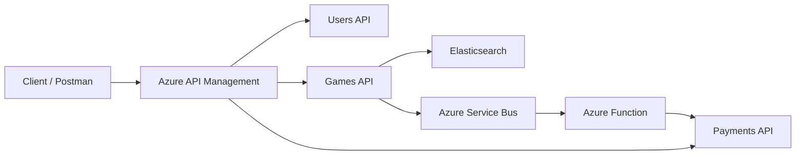

# 🎮 FIAP Cloud Games  
## Arquitetura de Microsserviços – Tech Challenge Fase 3

Projeto desenvolvido no **Tech Challenge da FIAP – Pós-Graduação em Arquitetura de Sistemas .NET**.

O objetivo desta fase foi construir uma arquitetura baseada em **microsserviços**, utilizando **API Gateway, comunicação assíncrona e busca avançada**, aplicando boas práticas de **DDD, segurança distribuída e integração em nuvem (Azure)**.

---

# 🏗️ Visão Geral da Arquitetura

A solução foi construída com:

- ✅ Arquitetura de Microsserviços  
- ✅ API Gateway (Azure API Management)  
- ✅ Comunicação Assíncrona (Azure Service Bus)  
- ✅ Orquestração Serverless (Azure Function)  
- ✅ Busca avançada com Elasticsearch  
- ✅ Autenticação distribuída com JWT  
- ✅ Persistência relacional (PostgreSQL)  
- ✅ Conteinerização com Docker  

---

# 🧩 Microsserviços

## 🔐 Users API

Responsável por:

- Cadastro de usuários  
- Autenticação  
- Geração de JWT  
- Controle de acesso por roles  

Atua como **provedora de identidade do ecossistema**.

---

## 🎮 Games API

Responsável por:

- Cadastro e manutenção de jogos  
- Catálogo de jogos  
- Busca full-text  
- Recomendações por gênero e plataforma  
- Publicação de eventos de pedido  

Integra com:

- PostgreSQL  
- Elasticsearch  
- Azure Service Bus  

---

## 💳 Payments API

Responsável por:

- Processamento de pagamentos  
- Validação de regras de negócio  
- Persistência do histórico de pagamentos  
- Consulta de pagamentos  

---

## ⚡ Azure Function (Payment Processing)

Responsável por:

- Consumir eventos da fila `order-created`  
- Orquestrar criação de pagamento  
- Chamar Payments API via APIM  

Implementa o padrão **Event-Driven Architecture**.

---

# 🌐 API Gateway – Azure API Management

Todas as APIs são expostas por meio do Gateway: https://fcg-apim-pos.azure-api.net

## 🔗 Endpoints principais

- `/users`
- `/games`
- `/payments`


### Exemplos reais:
GET https://fcg-apim-pos.azure-api.net/users/api/User/users

GET https://fcg-apim-pos.azure-api.net/games/api/Game

GET https://fcg-apim-pos.azure-api.net/payments/api/Payments

---

# 🔐 Segurança

A arquitetura utiliza dupla camada de segurança:

### 1️⃣ Subscription Key (APIM)

Header obrigatório:
```http
Ocp-Apim-Subscription-Key: <sua-subscription-key>
```

### 2️⃣ JWT Bearer Authentication

Header obrigatório:
Authorization: Bearer <jwt-token>

---

# 🔄 Fluxo Assíncrono de Pagamento

- Pedido criado na Games API 
- Evento publicado no Azure Service Bus 
- Azure Function consome o evento 
- Function chama Payments API via APIM 
- Pagamento é processado e persistido 

Esse fluxo implementa comunicação desacoplada e resiliente.

---

# 🔍 Busca e Recomendações

A Games API utiliza Elasticsearch para:

- 🔎 Full-text search
- 🎯 Filtros por gênero
- 🖥️ Filtros por plataforma
- 🧠 Recomendações similares
- 📊 Agregações e métricas

---

# 🧭 Diagrama da Arquitetura


---
# 🛠️ Stack Tecnológica

- .NET 8
- Entity Framework Core
- PostgreSQL
- Elasticsearch
- Azure API Management
- Azure Service Bus
- Azure Functions (Isolated Worker)
- JWT Authentication
- Docker
---

# 🏛️ Padrões Arquiteturais Aplicados

- Microsserviços Independentes
- API Gateway Pattern
- Event-Driven Architecture
- Domain-Driven Design (DDD)
- Comunicação síncrona e assíncrona
- Autenticação distribuída
  
---

# 📌 Repositórios do Projeto

- Users API: https://github.com/FernandoLuisViana/FCG.Users  
- Games API: https://github.com/FernandoLuisViana/FCG.Games  
- Payments API: https://github.com/FernandoLuisViana/FCG.Payments  
- Azure Function: https://github.com/FernandoLuisViana/FCG.Functions  

---

# 🎯 Objetivo Acadêmico

- Demonstrar aplicação prática de:
- Arquitetura moderna em nuvem
- Segurança distribuída
- Integração entre microsserviços
- Mensageria
- Busca avançada
- Orquestração serverless
